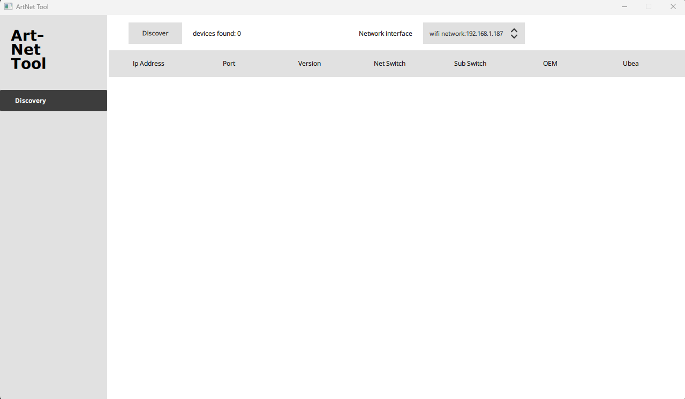
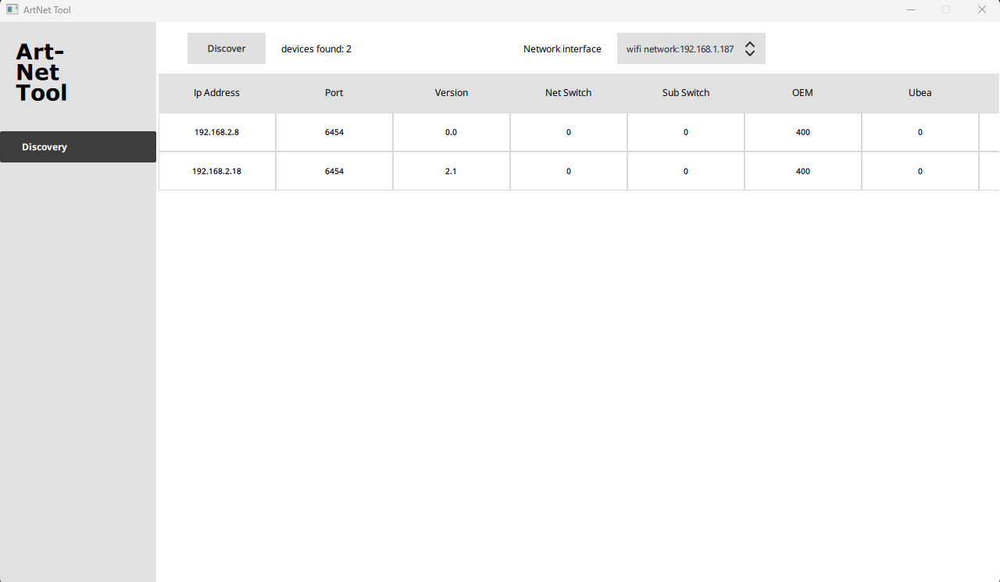

# Artnet Discovery Tool
A tool that performs artnet poll request, discovering all artnet nodes on a given network.

## Author
Denis Akopov

## Notes
This project was created using QT v.6+  
You will need QT Creator v9+ and QT v.6+ if you want to rebuild the project

## Usage
Win:  
unzip and run `artnet_discovery_tool.exe`  
First run: allow app to access public and private networks  
Select ethernet adapter that is on the same network as your artnet nodes  
Press `discover` 

Mac: 
unzip and run `artnet_discovery_tool`  
Select ethernet adapter that is on the same network as your artnet nodes  
Press `discover`

Alternatively, you can simulate an answer by running a python script in the 
tests folder (Requires Python 3.7+)  
Note: on mac type `python3` instead of `python`
```
cd tests
python sendartnetmessages.py "ip_address_of_the_selected_network_interface"
```




## License
LGPLv3
